# Iosevka Carrot 

**Iosevka Carrot** is an *open source, sans-serif, monospace + quasi‑proportional* typeface family, customised from the original [Iosevka](http://be5invis.github.io/Iosevka).  

TTF files of 2 variants, **Iosevka Carrot** and **Iosevka Carrot Mono** with **all** weights, slopes, and widths are available for download in the [Release Page](https://github.com/CarrotDLaw/Iosevka-Carrot/releases). Check `private-build-plans.toml` for detailed configuration of the fonts.

## Font Variants

### Iosevka Carrot — Quasi-proportional

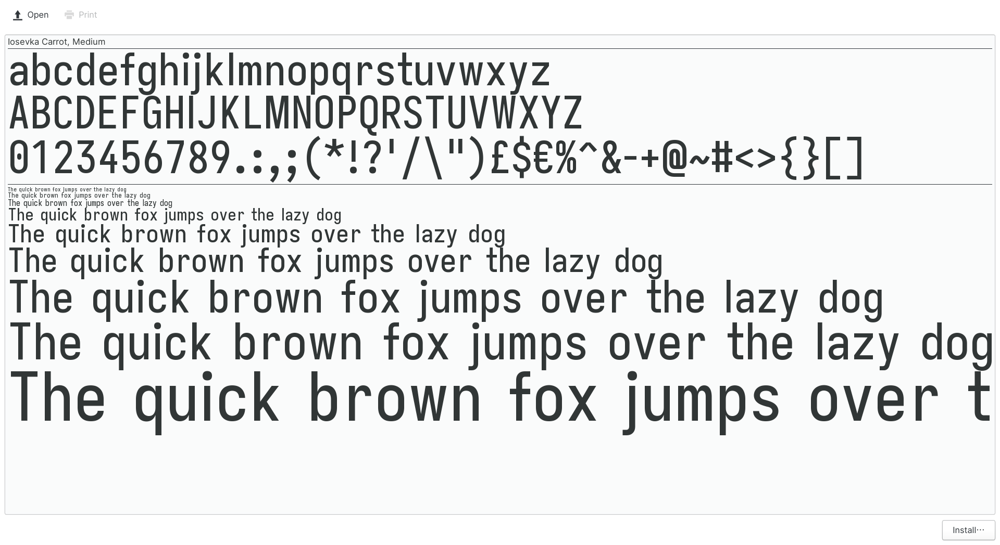
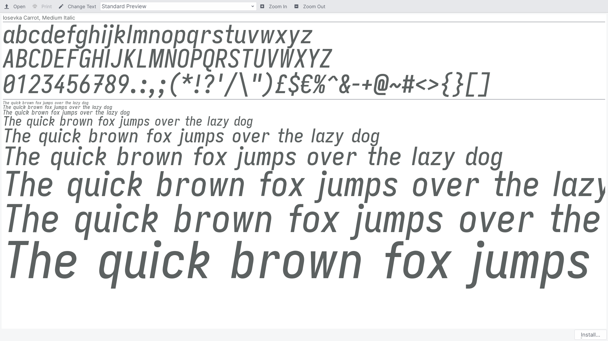

### Iosevka Carrot Extended — Quasi-proportional

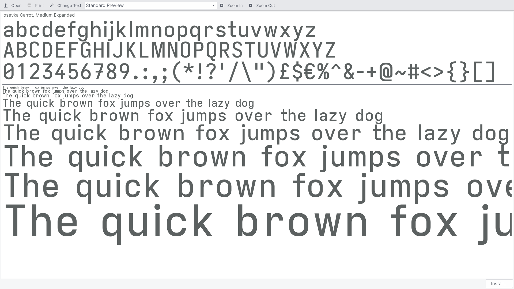
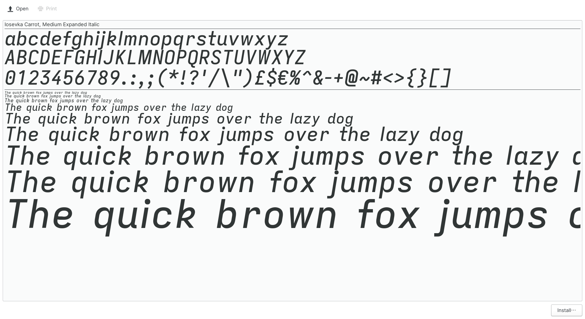

### Iosevka Carrot Mono — Monospace

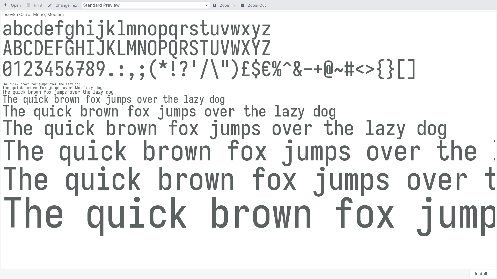
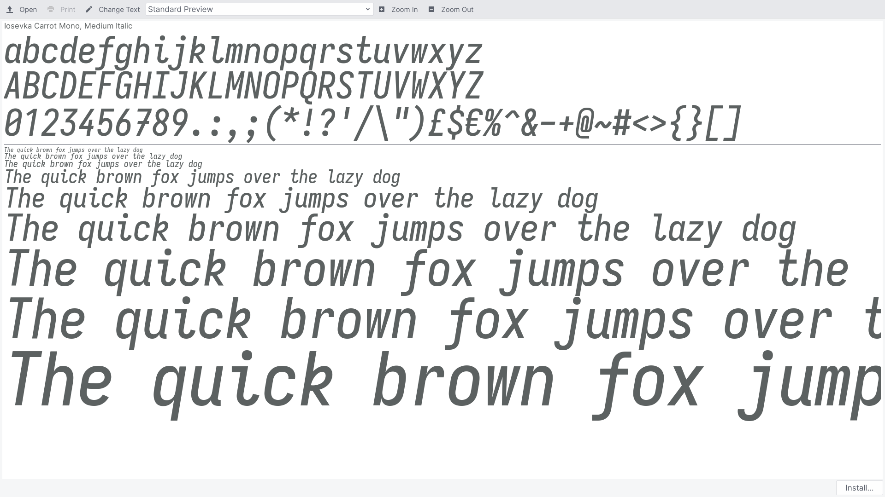

### Iosevka Carrot Mono Extended — Monospace

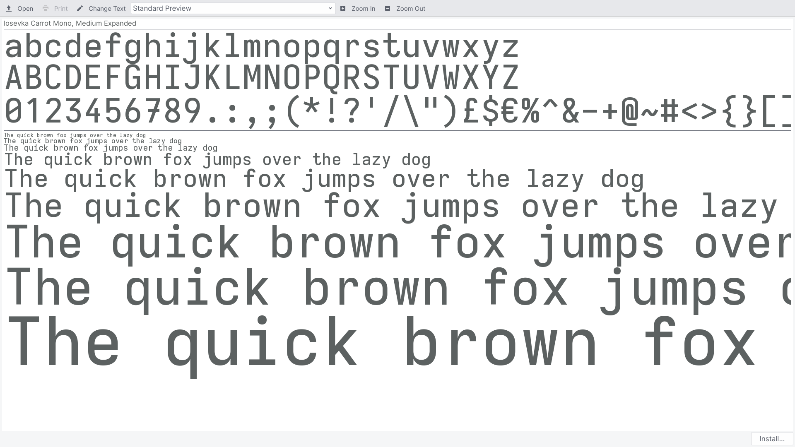
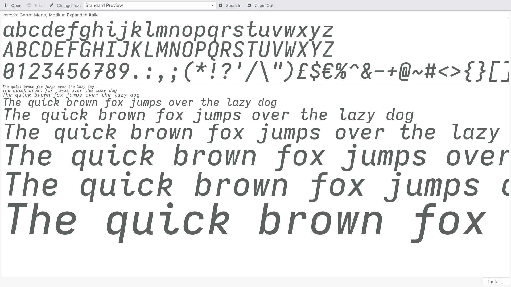

## Screenshots

### Iosevka Carrot Extended

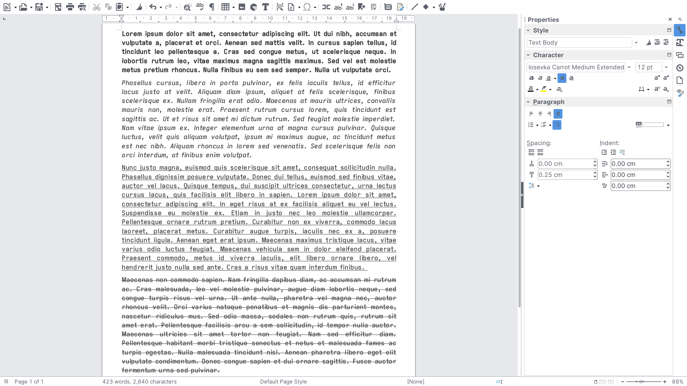

### Iosevka Carrot Mono Extended

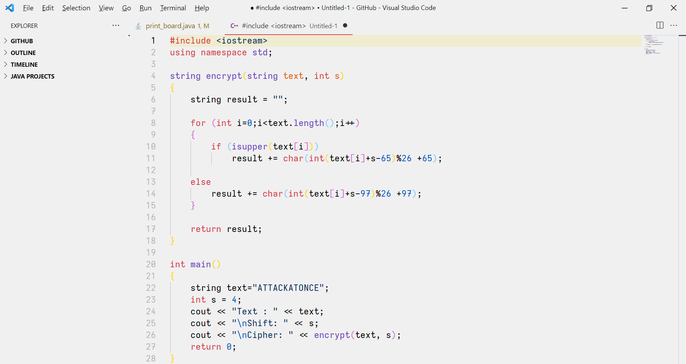
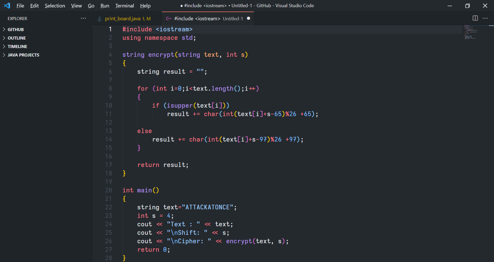
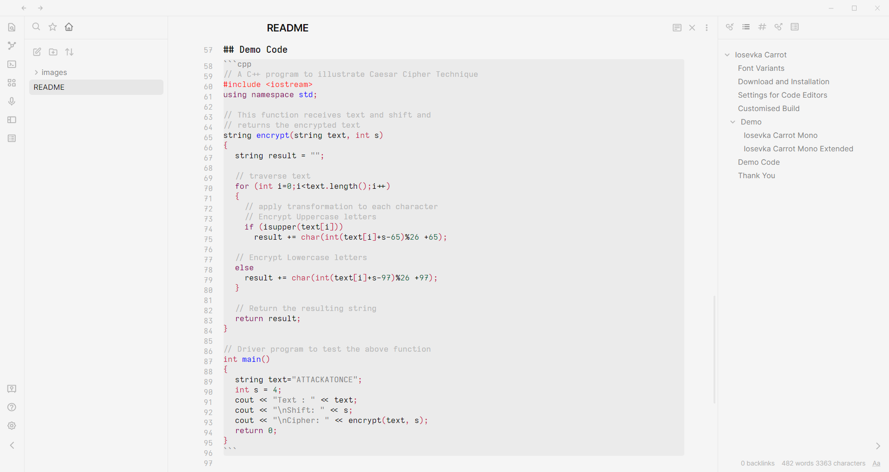
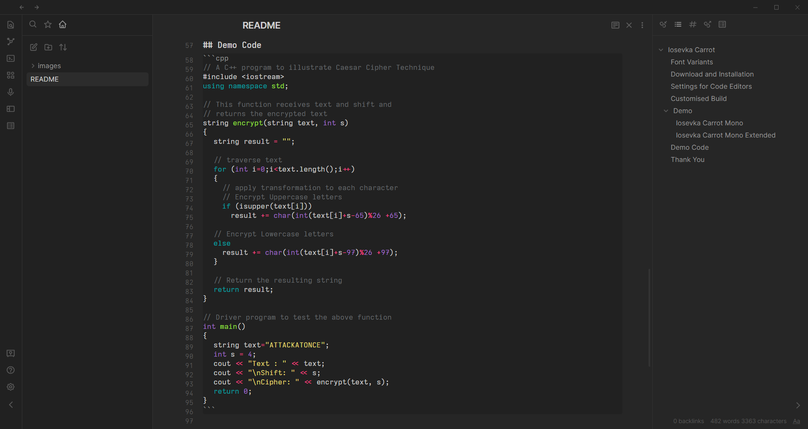

## Download and Installation

Download the fonts from the [Release Page](https://github.com/CarrotDLaw/Iosevka-Carrot/releases) in this repository. Unzip and open the folder `/iosevka-carrot`.

- **Instructions for Linux**: Copy the TTF files to your fonts directory, usually in your Home directory `~/.local/share/fonts/` . Then, run `sudo fc-cache -f -v`. For refreshing Font Cache in your system.
- **[Instructions for macOS](http://support.apple.com/kb/HT2509)**: Right click on TTF font files, and install it with FontBook App.
- **Instructions for Windows**: Select the font files and right click, then click “Install for all users” (RECOMMENDED) or “Install”.
  - Since Windows 10 1809, the default font installation is per-user, and it may cause compatibility issues for some applications, mostly written in Java. To cope with this, right click and select "Install for all users" instead. [Reference](https://youtrack.jetbrains.com/issue/JRE-1166?p=IDEA-200145)

## Settings and Use

Choose the font in the font list in any program and enjoy it!

If you type the font name manually or use it in CSS, note that the suffix `Expanded` should be used instead of `Extended` for Iosevka Carrot Extended or Iosevka Carrot Mono Extended.

### VS Code

To use the font, open `Settings > User > Text Editor > Font > Fonts Family`, type in `Iosevka Carrot Mono` or `Iosevka Carrot Mono Expanded`.

To turn on ligatures, or for more information, refer to this [guide](https://www.alphr.com/vs-code-how-to-change-font/).

## Customised Build

To create a custom build of Iosevka, you need:

1. Clone the source of [Iosevka](https://github.com/be5invis/Iosevka).

2. Copy `private-build-plans.toml` file in this repository and place it into the build source.

3. Ensure that [`nodejs`](http://nodejs.org) (≥ 12.16.0) and [`ttfautohint`](http://www.freetype.org/ttfautohint/) are present, and accessible from `PATH`.

4. Run `npm install`. This command will install **all** the NPM dependencies, and will also validate whether external dependencies are present.
   
5. Run `npm run build -- contents::<your plan name>` and the built fonts would be available in `dist/`. Aside from `contents::<plan>`, other options are:

   1. `contents::<plan>` : TTF (Hinted and Unhinted), WOFF(2) and Web font CSS;
   2. `ttf::<plan>` : TTF;
   3. `ttf-unhinted::<plan>` : Unhinted TTF only;
   4. `webfont::<plan>` : Web fonts only (CSS + WOFF2);
   5. `woff2::<plan>` : WOFF2 only.

Refer to [Iosevka/README.md](https://github.com/be5invis/Iosevka#customized-build) for more information.

## Thank You

Thank you to Belleve Invis, their developers, and contributors. Don't forget to check and download original Iosevka Font from [Iosevka's Website](https://typeof.net/Iosevka/) or [Iosevka's GitHub Page](https://github.com/be5invis/Iosevka).  
