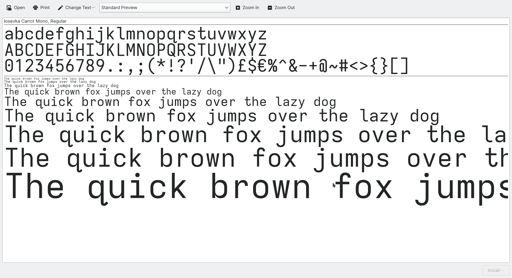
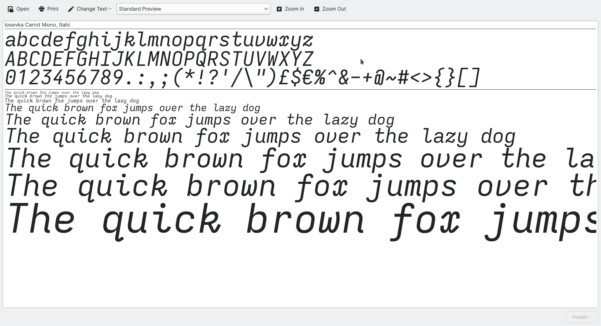
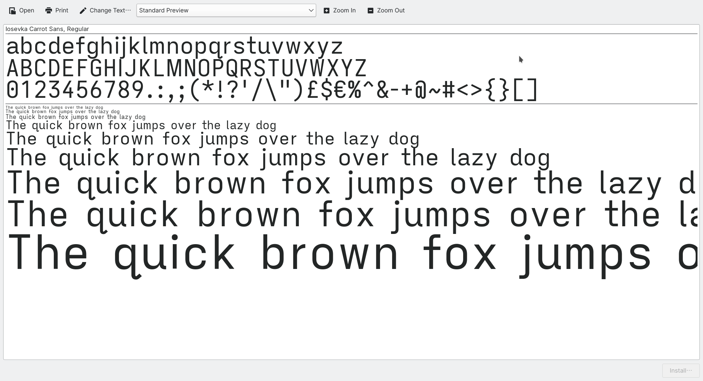
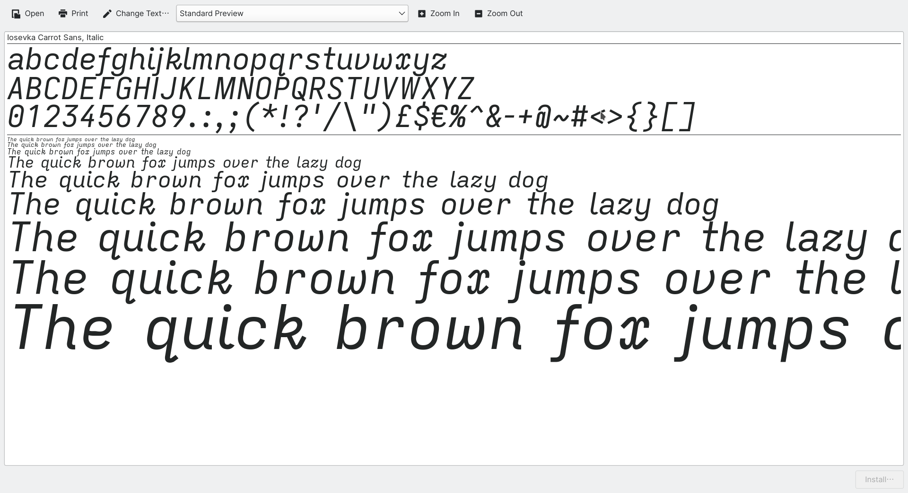
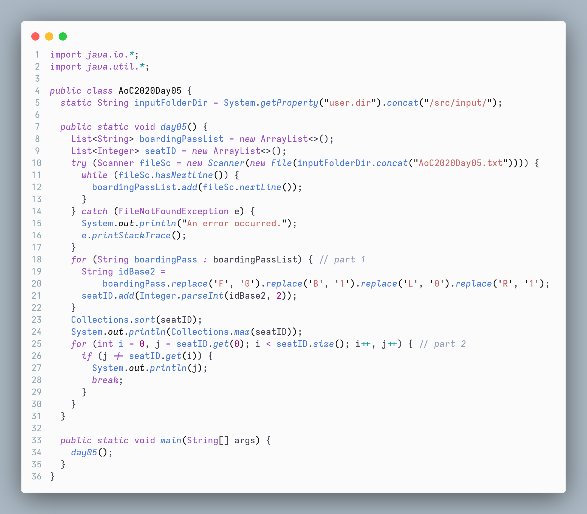
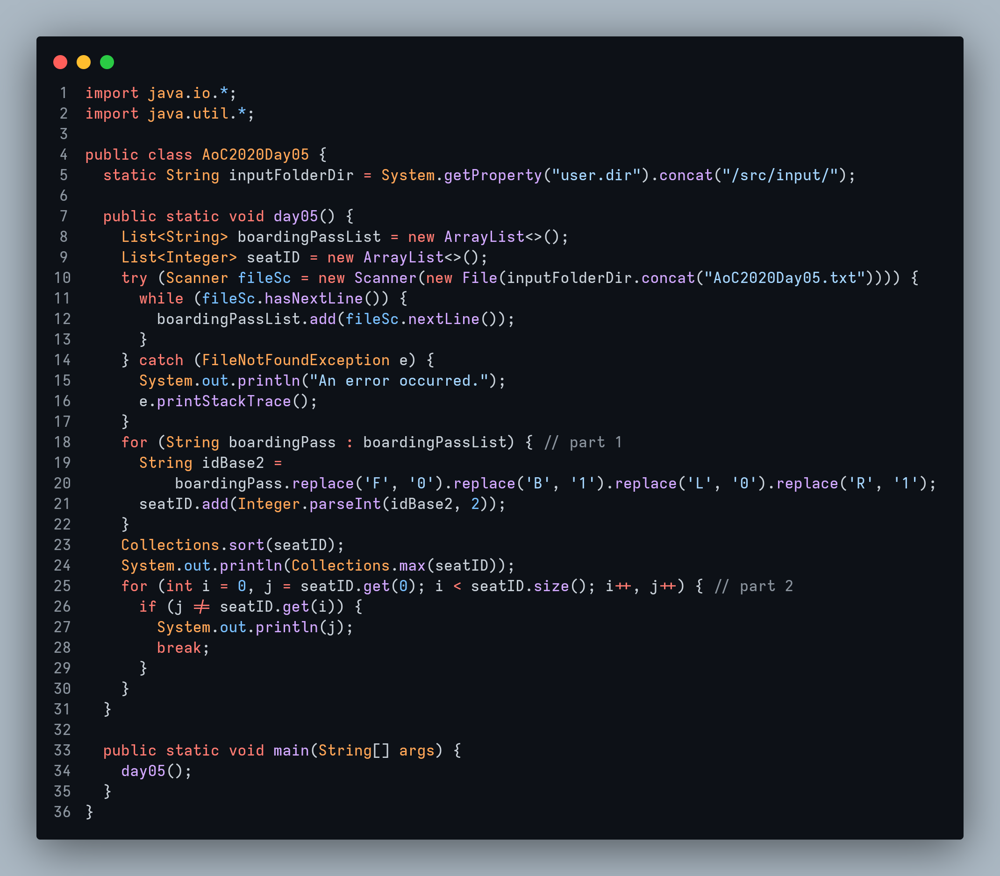
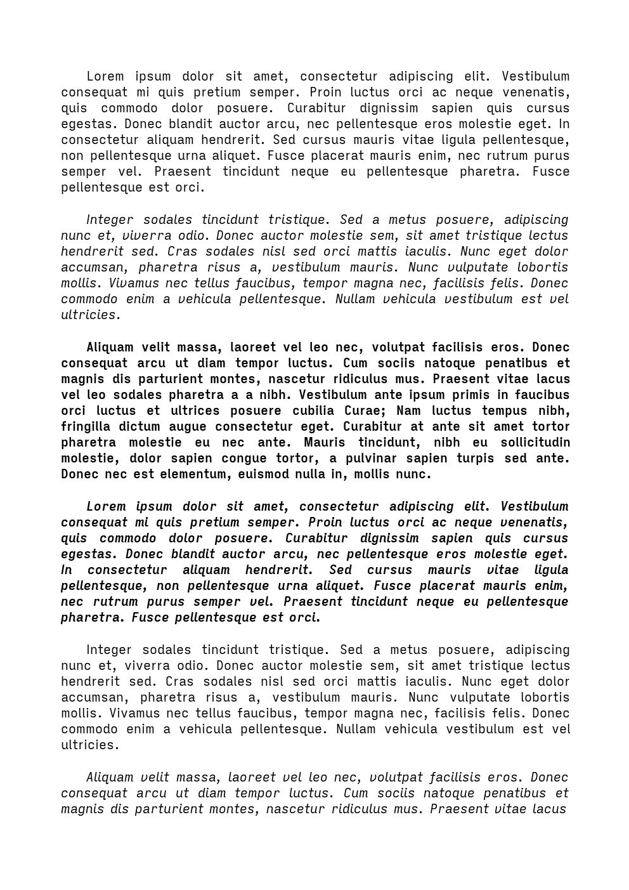

# Iosevka Carrot 

**Iosevka Carrot** is an *open source, sans-serif, monospace + quasi‑proportional* typeface family, customised from the original [Iosevka](http://be5invis.github.io/Iosevka).  

TTF files of 2 variants, **Iosevka Carrot Sans** and **Iosevka Carrot Mono** with 2 slopes and 9 widths, are available for download in the [Release Page](https://github.com/CarrotDLaw/Iosevka-Carrot/releases). Check [`private-build-plans.toml`](https://github.com/CarrotDLaw/Iosevka-Carrot/blob/main/private-build-plans.toml) for detailed configuration of the fonts.

## Font Variants

### Iosevka Carrot Mono — Monospace

### Iosevka Carrot Sans — Quasi-proportional

## Demo Screenshots

### Iosevka Carrot Mono

### Iosevka Carrot Sans

## Download and Installation

Download the fonts from the [Release Page](https://github.com/CarrotDLaw/Iosevka-Carrot/releases) in this repository. Quit your programs. Unzip and open the folder.

- **[Instructions for Linux](https://wiki.archlinux.org/title/fonts#Manual_installation)**: 
  - For a single user, install fonts to `~/.local/share/fonts/`. 
  - For system-wide (all users) installation, place your fonts under `/usr/local/share/fonts/`. 
  - Run `sudo fc-cache`

- **[Instructions for macOS](http://support.apple.com/HT2509)**: Right click on font files, and install it with FontBook app.

- **Instructions for Windows**: Select the font files and right click, then click 'Install for all users' (RECOMMENDED) or 'Install'.
  - Since Windows 10 1809, the default font installation is per-user, and it may cause compatibility issues for some applications, mostly written in Java. To cope with this, right click and select "Install for all users" instead. Check [reference](https://youtrack.jetbrains.com/issue/JRE-1166?p=IDEA-200145).

## Use and Settings

Choose the font in the font list in any program and enjoy it!

### VS Code

To use the font, open `Settings > User > Text Editor > Font > Fonts Family` and type `Iosevka Carrot Mono`.

To turn on ligatures, or for more information, refer to this [guide](https://www.alphr.com/vs-code-how-to-change-font/).

## Customised Build

Refer to the [Iosevka documentation](https://github.com/be5invis/Iosevka/blob/master/doc/custom-build.md) for more information.

For Linux users, refer to the [guide](https://github.com/Iosevka-Mayukai/HowToBuild) from [Iosevka Mayukai](https://github.com/Iosevka-Mayukai/Iosevka-Mayukai) as well.

## Licence

This font software is licensed under the SIL Open Font Licence, Version 1.1. This licence is available with a FAQ at: http://scripts.sil.org/OFL.

## Acknowledgments

- [Belleve Invis](https://github.com/be5invis)
- [Iosevka Mayukai](https://github.com/Iosevka-Mayukai)
- [Adam Kruszewski](https://github.com/adamkruszewski)
- All contributors
